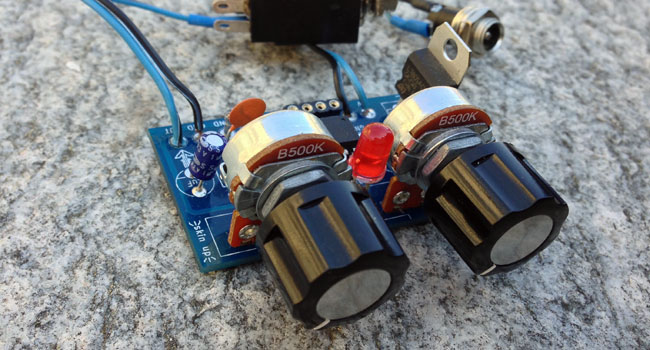

# ATtiny multiboard

A board hosting an ATtiny85 MCU and two potentiometers, typically used as a minimal sound generator.

In this repository you can find the schematic and the production files.

The building is straightforward, the LED will light up accordingly to the output signal.
Since I'm using a PWM output, a passive low pass filter can be customized by choosing
the values for R and C components.

Enjoy.
